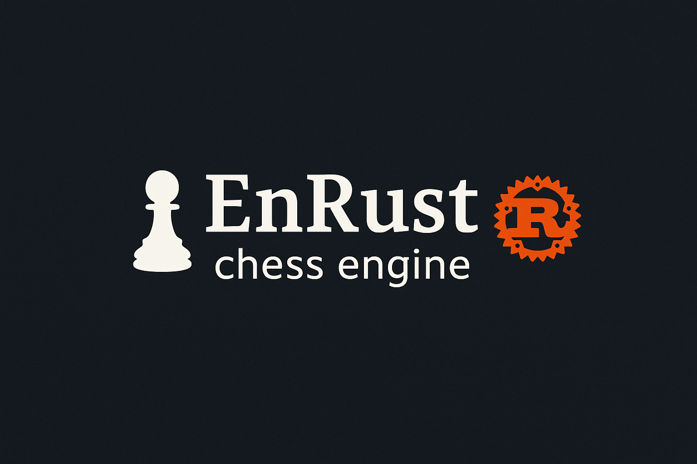

# EnRust




EnRust is a chess engine written in Rust.

The name comes from a fusion of the chess move en passant and the Rust programming language.

The goals of this project are:
- To learn and deepen my understanding of Rust.
- To improve my problem-solving and algorithmic skills.
- To eventually build a competitive chess engine.
- To share the journey in blog posts, so others can learn from the process.

## Architecture Highlights

### Piece List System
Instead of scanning the entire board, EnRust maintains separate lists for each piece type, enabling fast move generation and check detection.

### Mailbox Board
Uses a 12×10 board representation with sentinel squares around the edges for efficient boundary checking.

### Smart Move Generation
- Pin detection to avoid expensive make/unmake operations
- Check evasion for optimal move generation in check situations
- Legal move validation integrated directly into generation

## Installation

### Prerequisites
- Rust 1.70+ and Cargo

### Building from Source
```bash
git clone https://github.com/miklz/enrust.git
cd enrust
cargo build --release
```
The executable will be available at target/release/enrust.

## Usage
As a UCI Engine

1. Configure your chess GUI to use the engine executable
2. The engine supports the basic UCI commands

### Command Line Usage

```
# Start the engine in UCI mode
cargo run --release

# Or run the built binary
./target/release/enrust
```

## API Documentation

Comprehensive documentation is available:
```
# Generate and view documentation
cargo doc --open
```

## Development

### Project Structure

```
benches/
├── chess_benchmarks.rs     # Profile chess interface functions
├── perft_benchmarks.rs     # Profile move generation functions
└── search_benchmarks.rs    # Profile search algorithms

src/
├── lib.rs                  # Crate root and public API
├── game_state/             # High-level game state management
│   ├── board               # Core chess logic
│   |   ├── moves.rs        # Move handling
|   |   ├── piece_list.rs   # Piece tracking
|   |   ├── piece.rs        # Piece logic
|   |   └── search.rs       # Search algorithms
│   └── board.rs            # Core chess logic
│
└── uci.rs                  # UCI protocol handler

tests/
├── bishop_tests.rs             # Bishop logic validation
├── castling_tests.rs           # Castling logic validation
├── king_tests.rs               # King logic validation
├── knight_tests.rs             # Knight logic validation
├── minimax_alpha_beta_tests.rs # Minimax with prunning validation
├── minimax_tests.rs            # Minimax validation
├── negamax_tests.rs            # Negamax validation
├── pawn_tests.rs               # Pawn logic validation
├── perft_tests.rs              # Perft validation
├── queen_tests.rs              # Queen logic validation
└── rook_tests.rs               # Rook logic validation
```

### Testing

```
# Run tests
cargo test

# Run benchmars tests
cargo bench
```

### Debugging with Perft

```
# Start the engine
cargo run
# Set board position
position fen <fen-string>
# Use the built-in perft debugging
go perft <depth>  # Test move generation to depth
```

## Roadmap

### Algorithm Improvements

- Enhanced evaluation function
- Transposition tables
- Null-move pruning
- Opening book support

### Performance Optimizations

- Move ordering improvements
- Bitlist and Bitboard implementation
- Parallel search

### Features

- Endgame tablebase support
- Pondering mode enhancements
- Multi-variant support

## License

This project is licensed under the MIT License - see the [LICENSE](./LICENSE) file for details.